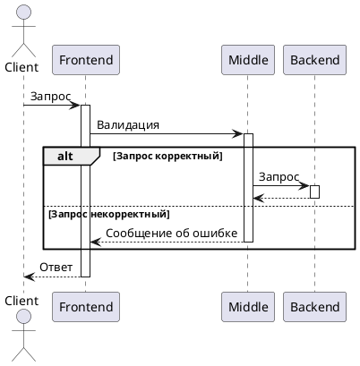

## Мини-банк

        Добро пожаловать в MVP банк с инновационным управлением через Telegram бота!  
    Наше решение предоставляет удобный и безопасный способ управления финансами  
    прямо из мессенджера.  
        С помощью нашего бота вы сможете легко осуществлять платежи, проверять баланс,  
    получать уведомления и многое другое, не покидая чат с друзьями или коллегами.  
    Для начала работы ознакомьтесь с инструкциями ниже и начните пользоваться  
    удобным и инновационным сервисом управления финансами!

* <a href="#Структура">Структура</a>
* <a href="#Стек">Стек</a>
* <a href="#Запуск">Запуск</a>
* <a href="#Пример-использования">Пример использования</a>

### Структура
- Frontend(telegram-bot на Kotlin)
- Middle-слой (Java-сервис)
- Backend (Java-сервис)

### Стек
- Java
- Kotlin
- Spring Boot
- Posgresql
- Gradle

### Запуск
// TODO

### Пример использования

